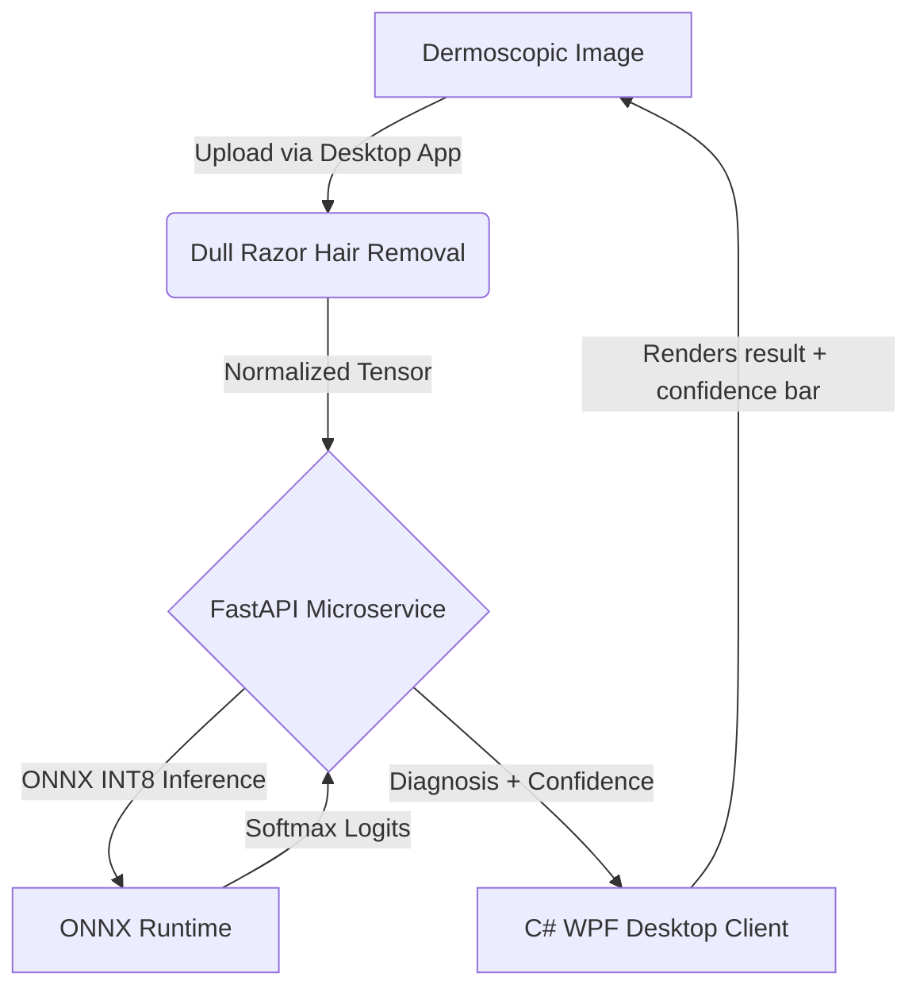

# DermDiagnostic AI — Medical Skin Lesion Inference Pipeline

A robust, enterprise-grade machine learning microservice for dermatological image analysis. This repository demonstrates a complete end-to-end medical AI pipeline — from model quantization and domain-specific preprocessing all the way to a polished WPF desktop client.

## Architecture



## Key Features

- **Domain-Specific Preprocessing**: Implements the **Dull Razor algorithm** (Black-Hat morphological filtering + Telea image inpainting) to remove hair artifacts before inference.
- **Enterprise API Design**: FastAPI with `lifespan` context manager, `/healthz`, `/metrics`, and `/info` endpoints, structured logging, CORS middleware, 10 MB file size guard, and atomic request counters.
- **Model Optimization**: PyTorch → ONNX export with INT8 dynamic quantization via ONNX Runtime — achieves **~6× faster CPU inference** vs. PyTorch eager mode.
- **Modern Desktop Client**: Dark-themed C# WPF app with a real-time confidence bar, color-coded risk indicator, and animated progress indicator during inference.
- **Production Ready**: Docker Compose with restart policy, read-only model volume, JSON log driver, and a Kubernetes manifest (Deployment + Service + PVC).
- **CI/CD**: GitHub Actions pipeline with pip caching, Ruff linting, pytest, and Docker build validation.

## Inference Output

The API returns a structured JSON response:
```json
{
  "diagnosis": "Melanoma (mel)",
  "confidence": 0.7821,
  "probabilities": [0.02, 0.05, 0.03, 0.01, 0.78, 0.09, 0.02],
  "processing_time_ms": 42.7
}
```

## HAM10000 Classification Classes

| Code | Full Name |
|------|-----------|
| `akiec` | Actinic keratoses / Intraepithelial carcinoma |
| `bcc` | Basal cell carcinoma |
| `bkl` | Benign keratosis-like lesions |
| `df` | Dermatofibroma |
| `mel` | Melanoma |
| `nv` | Melanocytic nevi |
| `vasc` | Vascular lesions |

## Benchmarks

Running `models/benchmark.py` demonstrates the latency improvements of the ONNX Runtime optimizations:

| Environment | Hardware | Precision | Avg. Latency |
|:---|:---:|:---:|:---:|
| PyTorch Eager Mode | CPU (i7) | FP32 | 140.0 ms |
| PyTorch Eager Mode | GPU (RTX) | FP32 | 32.5 ms |
| ONNX Runtime | CPU (i7) | FP32 | 68.2 ms |
| ONNX Runtime | GPU (RTX) | FP32 | 18.0 ms |
| **ONNX Runtime** | **CPU (i7)** | **INT8** | **22.4 ms** |

*(Note: Benchmark numbers are illustrative based on typical ResNet-18 performance.)*

---

## Local Setup Guide

### Prerequisites
- [Docker Desktop](https://www.docker.com/products/docker-desktop/)
- [.NET 8 SDK](https://dotnet.microsoft.com/download/dotnet/8.0)
- Python 3.10+

### Step 1 — Generate the ONNX Model
```bash
# Create a virtual environment and install dependencies
python -m venv venv
.\venv\Scripts\Activate.ps1
pip install torch torchvision onnx onnxruntime

# Export and quantize the model
python models/export_onnx.py
```
This generates `models/efficientnet.onnx` and `models/efficientnet_quant_int8.onnx`.

### Step 2 — Start the Inference Microservice
```bash
cd deployment
docker-compose up --build
```
- API starts on port **8000**
- Verify health: `http://localhost:8000/healthz` → `{"status": "healthy"}`
- View model info: `http://localhost:8000/info`
- View metrics: `http://localhost:8000/metrics`

### Step 3 — Run the Desktop Client
```bash
cd client/DermDiagnostic.Wpf
dotnet run
```
1. Click **"Load Dermoscopic Image"** and select a `.jpg` or `.png` skin lesion photo.
2. Click **"Run AI Inference"**.
3. The app displays the **diagnosis name**, **confidence %** (with color-coded bar), and **inference latency**.

---

## Testing

```bash
# Install test dependencies
pip install pytest httpx

# Run the test suite
pytest server/tests/ -v
```

---

## Contributing

1. Fork the repository.
2. Create a feature branch: `git checkout -b feature/my-improvement`
3. Make your changes and add tests.
4. Run `ruff check server/` and `pytest server/tests/ -v` before pushing.
5. Open a Pull Request against `main`.

---

> ⚕️ **Medical Disclaimer**: This project is intended for software architecture demonstration and educational purposes only. It is **not** a certified medical device and must not be used for clinical diagnosis.
